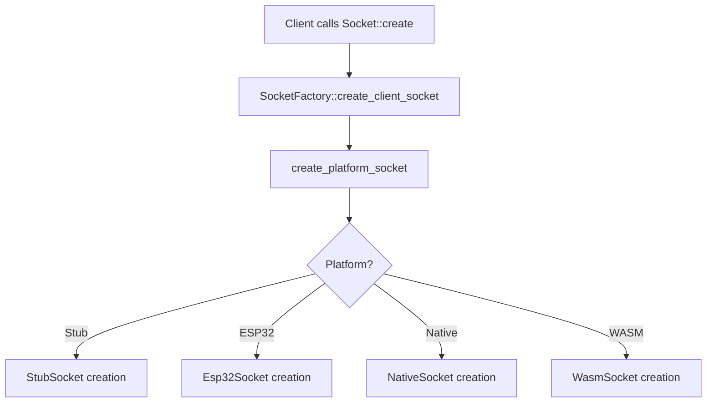

# FastLED Networking Platform Design Solution

## Problem Statement

The original networking design used a **registration pattern** that forced all platform-specific networking code to be linked, even when clients never used networking functionality. This violated the "pay for what you use" principle.

### Original Problematic Design

```cpp
// ❌ PROBLEMATIC: Registration forces global constructors
void register_stub_socket_factories() {
    SocketFactory::register_platform_factory(
        [](const SocketOptions& opts) { return make_shared<StubSocket>(opts); },
        [](const SocketOptions& opts) { return make_shared<StubServerSocket>(opts); }
    );
}

// Called by global constructors, links ALL networking code
static auto init = []() { register_stub_socket_factories(); return 0; }();
```

**Issues:**
- Global constructors execute at startup, linking ALL platform code
- ESP32 networking gets linked even for simple LED projects  
- No way to avoid networking overhead if not used
- Violates FastLED's principle of minimal resource usage

## Solution: Direct Platform-Specific Functions

Following FastLED's proven pattern used by `ClocklessController`, we replaced registration with **direct platform-specific function calls** resolved at compile time.

### New Design Architecture

```cpp
// ✅ SOLUTION: Direct platform-specific declarations
namespace fl {

// Platform-agnostic factory interface
class SocketFactory {
public:
    static fl::shared_ptr<Socket> create_client_socket(const SocketOptions& options = {});
    static fl::shared_ptr<ServerSocket> create_server_socket(const SocketOptions& options = {});
    static bool supports_ipv6();
    static bool supports_tls();
    // ... other capability queries
};

// Platform-specific functions - each platform provides these
// Only the platform being compiled will provide these symbols
fl::shared_ptr<Socket> create_platform_socket(const SocketOptions& options);
fl::shared_ptr<ServerSocket> create_platform_server_socket(const SocketOptions& options);
bool platform_supports_ipv6();
bool platform_supports_tls();
// ... other platform capability functions

}
```

### Implementation Details

#### 1. Generic Factory Implementation (Always Linked)

```cpp
// src/fl/networking/socket_factory.cpp
fl::shared_ptr<Socket> SocketFactory::create_client_socket(const SocketOptions& options) {
    return create_platform_socket(options);  // Direct call - no registration
}

bool SocketFactory::supports_ipv6() {
    return platform_supports_ipv6();  // Direct call - no registration
}
```

#### 2. Platform-Specific Implementations (Conditionally Linked)

**Stub Platform (Testing):**
```cpp
// src/platforms/stub/networking/stub_socket.cpp
fl::shared_ptr<Socket> create_platform_socket(const SocketOptions& options) {
    return fl::make_shared<StubSocket>(options);
}

bool platform_supports_ipv6() {
    return false;  // Stub doesn't support IPv6
}
```

**ESP32 Platform (WiFi):**
```cpp
// src/platforms/esp/networking/esp32_socket.cpp
#ifdef ESP32

fl::shared_ptr<Socket> create_platform_socket(const SocketOptions& options) {
    return fl::make_shared<Esp32Socket>(options);
}

bool platform_supports_ipv6() {
    return true;  // ESP32 supports IPv6
}

#endif // ESP32
```

## Key Benefits

### ✅ Pay-for-What-You-Use Linking

- **Client never calls networking** → No networking code linked
- **Client calls `Socket::create()`** → Only the platform's networking implementation gets linked
- **No global constructors** → No startup overhead

### ✅ Platform Flexibility

Each platform can provide networking suited to its capabilities:

- **Stub**: Mock sockets for testing
- **ESP32**: WiFi-based sockets using Arduino WiFi library  
- **Native**: POSIX sockets for desktop/server applications
- **WASM**: WebSocket-based networking for browser applications

### ✅ Consistent with FastLED Architecture

This follows the exact same pattern as `ClocklessController`:

```cpp
// LED Controllers - Direct template instantiation
template <int DATA_PIN, int T1, int T2, int T3, EOrder RGB_ORDER = RGB>
class ClocklessController : public CPixelLEDController<RGB_ORDER> {
    // Platform-specific implementation selected at compile time
};

// Networking - Direct function calls  
fl::shared_ptr<Socket> create_platform_socket(const SocketOptions& options) {
    // Platform-specific implementation selected at compile time
}
```

### ✅ Zero Runtime Overhead

- **No function pointers** to store or call
- **No registration system** to maintain
- **No dynamic dispatch** beyond normal virtual function calls
- **Direct symbol resolution** at link time

## Migration Path

### For Platform Developers

**Before (Registration):**
```cpp
void register_platform_sockets() {
    SocketFactory::register_platform_factory(
        [](const SocketOptions& opts) { return make_shared<PlatformSocket>(opts); },
        [](const SocketOptions& opts) { return make_shared<PlatformServerSocket>(opts); }
    );
}
```

**After (Direct Implementation):**
```cpp
fl::shared_ptr<Socket> create_platform_socket(const SocketOptions& options) {
    return fl::make_shared<PlatformSocket>(options);
}

fl::shared_ptr<ServerSocket> create_platform_server_socket(const SocketOptions& options) {
    return fl::make_shared<PlatformServerSocket>(options);
}

bool platform_supports_ipv6() {
    return true; // or false, depending on platform capabilities
}
```

### For Client Code

**No changes required!** Client code continues to work exactly the same:

```cpp
// This still works exactly the same
auto socket = Socket::create();
socket->connect("api.example.com", 80);
```

## Technical Implementation

### Linker Symbol Resolution



**Key Point:** Only the platform being compiled provides the `create_platform_socket` symbol. The linker automatically resolves to the correct implementation without any registration or runtime overhead.

### Compile-Time Platform Selection

```cpp
// Conditional compilation ensures only one implementation is built
#ifdef ESP32
// ESP32 implementation
fl::shared_ptr<Socket> create_platform_socket(const SocketOptions& options) {
    return fl::make_shared<Esp32Socket>(options);
}
#elif defined(FASTLED_STUB_IMPL)  
// Stub implementation
fl::shared_ptr<Socket> create_platform_socket(const SocketOptions& options) {
    return fl::make_shared<StubSocket>(options);
}
#elif defined(__linux__) || defined(__APPLE__) || defined(_WIN32)
// Native POSIX/Windows implementation  
fl::shared_ptr<Socket> create_platform_socket(const SocketOptions& options) {
    return fl::make_shared<NativeSocket>(options);
}
#endif
```

## Conclusion

This design eliminates the core problem: **platform implementations are now linked through client usage**, not through global constructors. The network library truly lives "behind symbols that can be traced back to client usage."

The result is a clean, efficient design that follows FastLED's proven architectural patterns while providing complete platform flexibility and zero-overhead for clients that don't use networking. 
