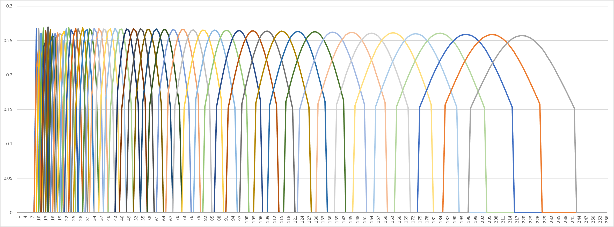

# cq_kernel

A fast C library that generates and applies spectral kernels on the output of an FFT, resulting in a constant Q transform overall and as specified in "An efficient algorithm for the calculation of a constant Q transform" by Brown (google it for reference). It is dependent on [kissfft](https://github.com/mborgerding/kissfft), so the v131 release is bundled here, but it can also be applied on the output of any FFT program.

While initalizing, this library is relatively slow and memory-heavy: it needs to execute an FFT for one band at a time, requiring two buffers for its real input and complex output. However, the library uses a little less (and not much more) at runtime by storing all the kernels as sparse arrays (throwing out the smallest values). Sparse arrays also make the library very fast at runtime, so embedded use is possible.

An example has been provided. Using `#define`'d parameters, it generates and dumps its kernels in a format that can be pasted into Excel or MATLAB. To get the floating-point version, in the command line run:

```
make example
./bin/example
```

To get the Q15 version, in the command line run:

```
make example CFLAGS="-D FIXED_POINT=16"
./bin/example
```

There is a Q31 version that is currently broken. To try that, in the command line run:
```
make example CFLAGS="-D FIXED_POINT=32"
./bin/example
```

Here is what that Excel plot of the kernels ("K_mag.txt") looks like. It is very similar to Figure 2 in the CQT paper:



**Be warned**, making the maximum frequency too close to half the sampling frequency causes the kernels to degenerate. Not having enough samples also causes the kernels to degenerate, so *please edit, compile, then run the example to make sure your desired parameters are valid!*

Now, to use this library in a project, retrieve the files

```
_kiss_fft_guts.h
cq_kernel.c
cq_kernel.h
kiss_fft.c
kiss_fft.h
kiss_fftr.c
kiss_fftr.h
```

and write something like this (if you're using the included kissfft library)

```C
#include "kiss_fftr.h"
#include "cq_kernel.h"

int main(){
    struct cq_kernel_cfg cq_cfg = {
        .samples = SAMPLES,
        .bands = BANDS,
        .fmin = MIN_FREQUENCY,
        .fmax = MAX_FREQUENCY,
        .fs = SAMPLING_FREQUENCY,
        .min_val = MIN_VAL
    };

    kiss_fft_cfg fft_cfg = kiss_fftr_alloc(SAMPLES, 0, NULL, NULL);
    cq_kernels_t kernels = generate_kernels(cq_cfg);
    kernels = reallocate_kernels(kernels, cq_cfg); // optional

    while(1){
        // <Generate/retreive "in" signal here>
        kiss_fft_cpx fft[SAMPLES] = {0};
        kiss_fftr(fft_cfg, in, fft);
        kiss_fft_cpx cq[BANDS] = {0};
        apply_kernels(fft, cq, kernels, cq_cfg);
        // <Process "cq" output here>
    }

    free(fft_cfg);
    free_kernels(kernels, cq_cfg)
    return 0;
}
```

and compile it with the appropriate flag based on the desired format, as required by kissfft. There is no flag for floating point. For Q15, that is `-D FIXED_POINT=16`. For Q31, that is `-D FIXED_POINT=32`.